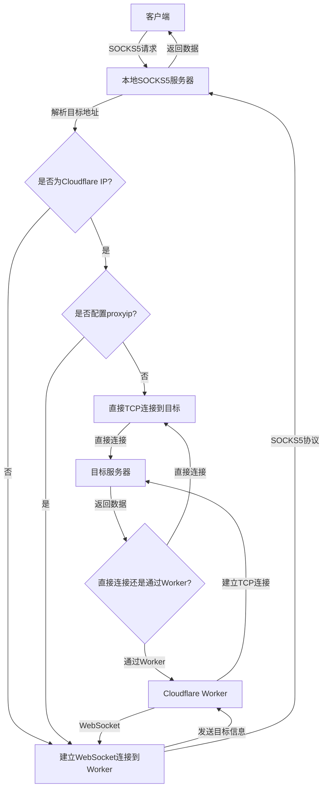

# CF-Worker-Socks

### 基于 Cloudflare Worker 的 SOCKS5 代理服务器

一个部署在 Cloudflare Worker 上的高性能、灵活可配置的代理工具

### 主要特点

- **基于 Cloudflare Worker**: 利用 Cloudflare 的全球网络,无需额外服务器即可部署
- **SOCKS5 协议支持**: 兼容性广泛,可用于各种应用程序
- **智能路由**: 自动识别 Cloudflare IP,根据目标地址选择最优连接路径
- **灵活配置**:
  - 可自定义 Worker IP 和端口
  - 支持指定域名强制走 Worker 代理
  - 可配置未被屏蔽的 Cloudflare IP 和端口
- **高性能**: 针对 Cloudflare IP 优化,可自动选择直连以提高速度
- **纯 Node.js 实现**: 无需依赖第三方软件,易于部署和维护
- **安全性**: 支持密码认证,保护代理服务不被未授权访问
- **错误处理**: 完善的错误处理机制,提高稳定性
- **日志记录**: 详细的日志记录,便于问题诊断和性能优化

### 连接原理流程图



### 工作原理详解

1. 客户端发送 SOCKS5 请求到本地 SOCKS5 服务器。
2. 本地服务器解析目标地址,判断是否为 Cloudflare IP。
3. 如果是 Cloudflare IP 且未配置 proxyip:
   - 直接建立 TCP 连接到目标地址。
4. 否则:
   - 建立 WebSocket 连接到 Cloudflare Worker。
   - 通过 Worker 转发数据到目标地址。
5. 数据传输:
   - 如果是直接连接,数据直接在客户端和目标服务器之间传输。
   - 如果通过 Worker,数据经由 WebSocket 和 Worker 中转。
6. 返回数据按原路径传回客户端。

这个流程确保了根据目标地址和配置,选择最优的连接路径,既能利用 Cloudflare 的全球网络,又能在可能的情况下实现直连以提高性能。

### 使用方法

1. 修改 `worker.js` 中的 `passwd` 变量，然后部署到 Cloudflare Worker

2. 部署完成后，在 Cloudflare Worker 中获取到域名

3. 在本地创建或修改 `config.json` 配置文件:

```json
{
  "domain": "your-worker-domain.example.com",
  "psw": "your-password",
  "sport": 1080,
  "sbind": "127.0.0.1",
  "wkip": "",
  "wkport": 0,
  "proxyip": "",
  "proxyport": 0,
  "cfhs": ["example.com"]
}
```

配置说明:

- `domain`: Worker 的域名(必填)
- `psw`: 与 Worker 中设置的密码一致(必填)
- `sport`: 本地 SOCKS5 代理端口(必填)
- `sbind`: 本地绑定地址，通常为 127.0.0.1(必填)
- `wkip`: 指定连接 Worker 的 IP(可选)
- `wkport`: 指定连接 Worker 的端口(可选)
- `proxyip`: 指定未被屏蔽的 Cloudflare IP(可选)
- `proxyport`: 指定未被屏蔽的 Cloudflare IP 端口(可选)
- `cfhs`: 指定强制走 Worker 代理的域名列表(可选)

4. 运行程序：

   - 对于 Go 版本：编译并运行 `go run main.go` 或 `go build -o cf-worker-socks5 && ./cf-worker-socks5`
   - 对于 Node.js 版本：运行 `node cli.js`

5. 本地会开启 SOCKS5 代理服务

6. 配置浏览器或其他应用程序使用该代理

### 新版本（Go）的主要变化

1. **性能提升**：

   - 使用 Go 语言实现，提供更好的并发性能和资源利用率。
   - 内置更高效的 DNS 解析和缓存机制。

2. **更强大的网络处理**：

   - 支持 IPv6，提供更全面的网络协议支持。
   - 改进的 Cloudflare IP 检测算法，支持 IPv4 和 IPv6 CIDR。

3. **增强的错误处理和日志记录**：

   - 更详细的错误日志，便于调试和问题诊断。
   - 优化的连接管理和错误恢复机制。

4. **代码结构优化**：

   - 更清晰的模块化设计，便于维护和扩展。
   - 使用 Go 的标准库和优秀的第三方包（如 gorilla/websocket）提高代码质量。

5. **配置灵活性**：

   - 支持更多自定义配置选项，如 WebSocket 连接超时设置。
   - 改进的配置文件解析和验证。

6. **安全性提升**：

   - 使用 TLS 配置增强 WebSocket 连接的安全性。
   - 支持自定义 TLS 配置，如禁用证书验证（仅用于特殊情况）。

7. **兼容性**：

   - 保持与旧版 Node.js 实现的配置文件兼容性，便于用户迁移。
   - 完全兼容 worker 的协议，无需修改 worker 的代码。

8. **部署便利性**：
   - 可以编译为单一可执行文件，无需安装额外的运行时环境。
   - 跨平台支持，可在多种操作系统上运行。

这些改进使得新版本在性能、安全性和可用性方面都有显著提升，同时保持了与旧版本的兼容性，方便用户平滑迁移。

### 高级配置

1. **自定义 Worker 连接**:

   - 设置 `wkip` 和 `wkport` 可以指定连接 Worker 的 IP 和端口
   - 这在某些网络环境下可能会提高连接稳定性和速度

2. **强制代理特定域名**:

   - 通过 `cfhs` 配置可以指定哪些域名强制通过 Worker 代理
   - 适用于需要特殊处理的网站或服务

3. **自定义 Cloudflare IP**:
   - 设置 `proxyip` 和 `proxyport` 可以指定使用特定的 Cloudflare IP 和端口
   - 在某些网络环境下,这可能会绕过一些限制或提高性能

### 性能优化

- 程序会自动缓存 DNS 解析结果,减少重复查询
- 对于 Cloudflare IP,会尝试直接连接以减少延迟
- 使用 WebSocket 长连接,减少连接建立的开销

### 安全性考虑

- 使用 HTTPS 和 WSS 协议确保数据传输的安全性
- 支持密码认证,防止未授权使用
- 建议定期更改密码,并使用强密码

### 故障排除

1. 如果连接失败,检查 `config.json` 中的配置是否正确
2. 确保 Cloudflare Worker 已正确部署且密码设置正确
3. 检查本地防火墙设置,确保允许程序访问网络
4. 查看控制台输出的日志信息,了解具体错误原因

### 推荐工具

- Windows 用户可使用 Proxifier 为指定程序强制使用代理
- 推荐使用 SwitchyOmega 等浏览器插件管理代理设置

### 贡献指南

欢迎提交 Issue 和 Pull Request 来改进这个项目。在提交 PR 时,请确保:

1. 代码风格一致
2. 添加必要的注释和文档
3. 更新 README 文件以反映新的化

### 许可证

本项目采用 MIT 许可证。详情请参阅 [LICENSE](LICENSE) 文件。

### 免责声明

本工具仅供学习和研究使用。使用本工具时请遵守相关法律法规,不得用于非法用途。作者不对使用本工具导致的任何问题负责。
